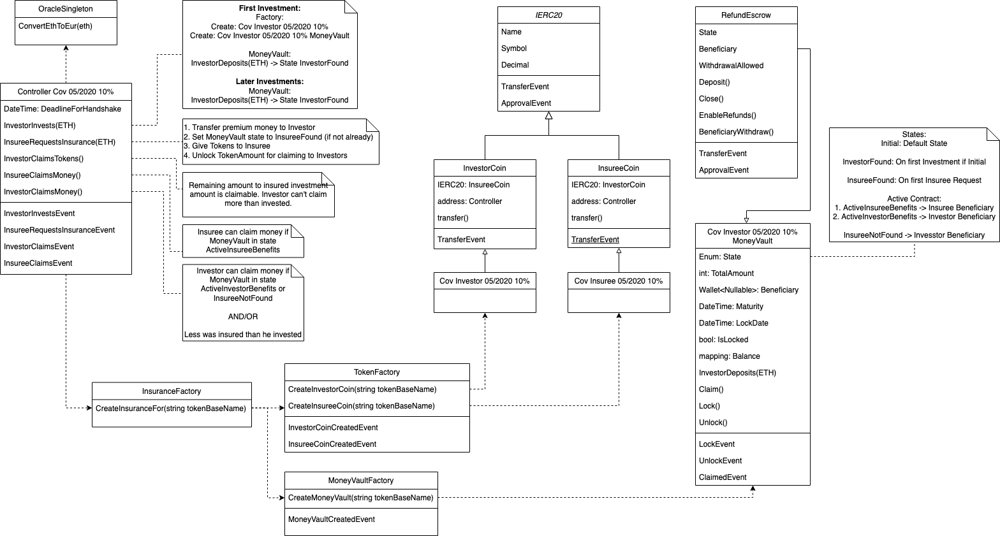

# COVSurance

## Get it running (on MacOS)

Install node

Install npm

Git clone

```
#brew upgrade
brew update
brew upgrade

#tap ethereum source
brew tap ethereum/ethereum

#install solidity 0.5.5 via commit hash from https://github.com/ethereum/homebrew-ethereum/commits/master/solidity.rb
brew unlink solidity
brew install https://raw.githubusercontent.com/ethereum/homebrew-ethereum/9d22d80c375611a69f78a01190a981968070d3ea/solidity.rb

#accept xcode license aggreement
sudo xcodebuild -license accept
```

## Compile Contracts

```
npm run-script compile
```

## Architecture

### ClassDiagram


