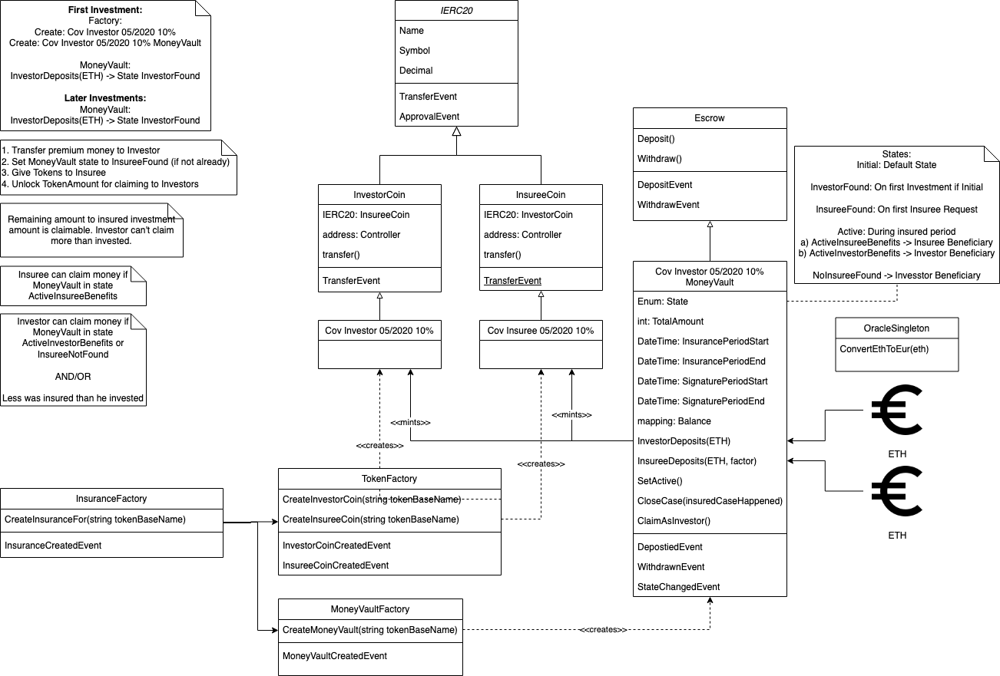

# COVSurance

## Get it running (on MacOS)

Install node

Install npm

Git clone

```
#brew upgrade
brew update
brew upgrade

#tap ethereum source
brew tap ethereum/ethereum

#install solidity 0.5.5 via commit hash from https://github.com/ethereum/homebrew-ethereum/commits/master/solidity.rb
brew unlink solidity
brew install https://raw.githubusercontent.com/ethereum/homebrew-ethereum/9d22d80c375611a69f78a01190a981968070d3ea/solidity.rb

#accept xcode license aggreement
sudo xcodebuild -license accept
```

## Compile Contracts

```
npm run-script compile
```

## Deployment

flatten into artifacts folder via

```
npm run-script flatten
```

manually remove all pragma lines except the first one.

open it via https://remix.ethereum.org/#optimize=true&evmVersion=null&version=soljson-v0.5.0+commit.1d4f565a.js

1. Deploy MoneyVaultFactory (and save addreses to Locator.json)
2. Deploy TokenFactory (and save addreses to Locator.json)
3. Deploy InsuranceFactory and use MoneyVaultFactory and TokenFactory addresses as deploy parameters (and save addreses to Locator.json)

Select contract of choice and press ABI button in remix IDE and save it to \*.abi.json into artifacts folder

## Architecture

### ClassDiagram


